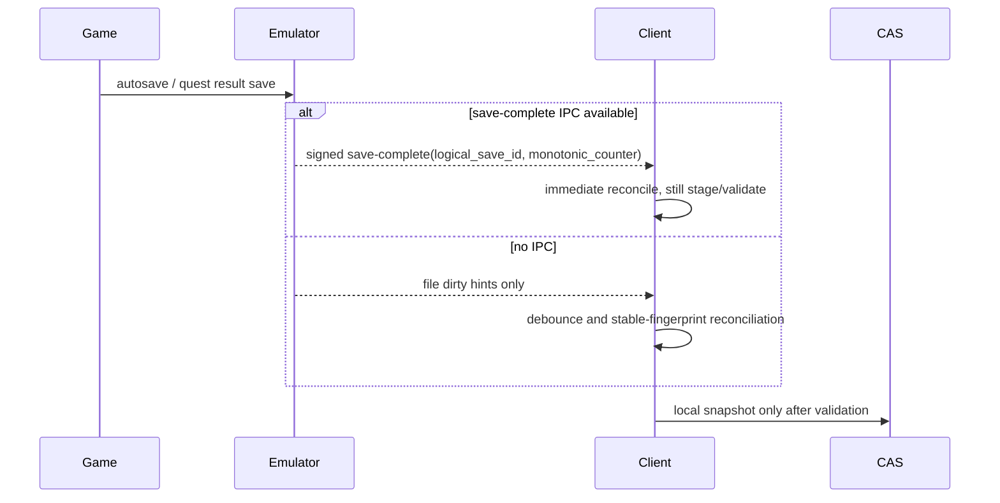
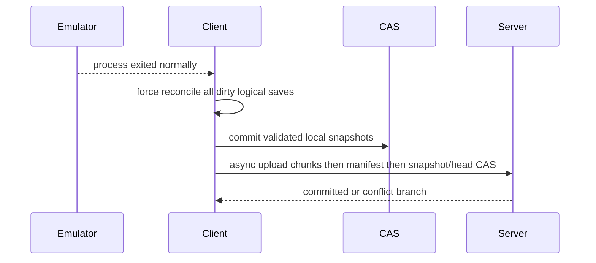

# Save Write Timelines and Trigger Policy

- Status: Phase 1 design baseline
- Last updated: 2026-07-04
- Scope: macOS FSEvents, Android SAF/FileObserver, managed emulator process lifecycle, synthetic fixture writers, and current Nemessix/Citra-family path evidence.

## 1. Core rule

A file event is a hint, never an upload. A snapshot candidate must pass:

1. dirty mark from save-complete, file event, exit, periodic reconcile or manual action;
2. debounce window;
3. two consecutive identical tree fingerprints;
4. read-only staging copy;
5. manifest/hash generation in staging;
6. adapter consistency validation;
7. second staging fingerprint verification;
8. local immutable snapshot commit;
9. upload queue enqueue.

Only an authenticated emulator `save-complete` event can skip the dirty-to-reconcile wait. It still cannot skip staging, hashing, validation, local CAS, or conflict checks.

## 2. Event diagrams

### 2.1 Manual in-game save

```mermaid
sequenceDiagram
  participant Game
  participant Emulator
  participant FS as File system / SAF
  participant Client
  participant CAS as Local CAS
  Game->>Emulator: User confirms save
  Emulator->>FS: write/truncate/rename one or more files
  FS-->>Client: FSEvents/FileObserver dirty hint
  Client->>Client: debounce + stable fingerprint loop
  Client->>FS: read-only staging copy
  Client->>Client: adapter validator + manifest limits
  Client->>CAS: immutable encrypted snapshot
  Client->>Client: enqueue upload; no live remote overwrite
```

### 2.2 Autosave / quest completion



### 2.3 Task end / normal exit



### 2.4 Background / sleep

```mermaid
sequenceDiagram
  participant OS
  participant Emulator
  participant Client
  OS-->>Client: app background / system sleep / Android lifecycle
  Client->>Client: mark active sessions requiring reconcile
  alt Android
    Client->>Client: visible foreground service if active; OneTimeWorkRequest after exit; PeriodicWorkRequest >=15 min backstop
  else macOS
    Client->>Client: helper/LaunchAgent keeps low-rate lifecycle status
  end
  Client->>Client: no remote restore while emulator is running/suspended
```

### 2.5 Remote newer before launch

```mermaid
sequenceDiagram
  participant User
  participant Client
  participant Server
  participant Emulator
  User->>Client: Launch through toolkit
  Client->>Server: check opaque head and conflict status
  alt fast-forward remote snapshot selected and emulator stopped
    Client->>Client: download to local CAS only
    Client->>Client: prompt or policy-gated restore; first snapshot current local state
  else conflict or bypassed toolkit launch
    Client-->>User: visible status; do not overwrite
  end
  Client->>Emulator: launch only after accepted gate
```

## 3. Failure timelines and required behavior

| Scenario | Observed or expected file behavior | Safe client behavior | Reject condition |
| --- | --- | --- | --- |
| Write in place | File size/hash changes while open. | Wait for stable tree, copy to staging, re-hash. | Snapshot if either source or staging fingerprint changes. |
| Temp + rename | Temp file appears, final path atomically changes. | Exclude known temp names; reconcile after rename stabilizes. | Upload temp or partial file. |
| Multi-file non-atomic write | File A stable while file B still changing. | Fingerprint whole logical save, not one file. | File-level upload without manifest consistency. |
| Delete | File disappears. | Encode tombstone in child snapshot; conflict with concurrent modification. | Physical GC or remote delete of history immediately. |
| Permission revoked | SAF/FSEvents/native path read fails. | Mark degraded, keep dirty, stop restore/upload for that root. | Treat missing tree as deletion snapshot. |
| Disk full during staging | Copy, compression, or SQLite/CAS write fails. | Abort candidate; original emulator directory unchanged. | Commit partial manifest or partial restore. |
| Strong kill / power loss | Process may stop mid-write or mid-restore. | On next launch recover journals, require stable source, and verify CAS. | HEAD points at missing chunks or restore leaves mixed files without rollback. |
| Server offline | Local snapshot and queue continue. | Keep local play; queue resumes later. | Block emulator launch or mutate local root because upload failed. |
| Remote newer while emulator active | Remote head differs. | Download to local CAS; notify only. | Live overwrite emulator save directory. |
| Clock drift | Device times inconsistent. | Use parent DAG and server CAS; display time only. | mtime/latest-wins conflict resolution. |

## 4. Default stability windows

Phase 1 default proposed in ADR 0003:

- debounce: 2 seconds after dirty hint;
- stable observations: 2 identical whole-tree fingerprints;
- observation gap: 500 ms;
- maximum wait per candidate: 10 seconds before reporting still-dirty;
- process exit: bypasses debounce but not stable observations, staging, or validation;
- adapter override: requires timeline evidence and test coverage.

## 5. Synthetic write timeline tests to implement and keep in CI

The engine must ship deterministic tests for:

1. 1,000 repeated dirty candidates where the writer leaves half-written bytes between observations;
2. write-in-place with truncation followed by final bytes;
3. temp-file write followed by rename;
4. multi-file non-atomic update with a validation rule requiring all files;
5. deletion snapshot and delete-vs-modify conflict;
6. permission error treated as degraded, not deletion;
7. disk-full simulation in staging/CAS;
8. restore interruption and journal rollback;
9. remote newer pre-launch gate;
10. running-emulator restore refusal.

## 6. Current evidence and gaps

- macOS Nemessix and Android Citra/Nemessix roots have real path and redacted fingerprint evidence in `EMULATOR_SAVE_MATRIX.md`.
- No authenticated `save-complete` IPC exists in current Nemessix/Azahar sources. The interface contract must be added separately before save-complete can outrank file dirty hints.
- Android package sandbox access via `run-as` is denied for all observed packages; SAF/IPC is mandatory.
- The 1,000-loop synthetic stability test now exists in `crates/save-engine` and passed on 2026-07-04 via `rtk cargo test --workspace` (15 tests across 14 suites, 1.07s). It covers repeated half-write followed by final write and asserts only the complete bytes are snapshotted. Additional real-emulator timelines remain pending.
